# 🏗️ oh-my-orq Architecture & Internal Workflow Guide

This document explains how **oh-my-orq** operates inside Antigravity and other IDE tools (VS Code, Cursor, Claude Code, Windsurf), as well as its complete internal execution workflow.

---

## 🚀 How to Use oh-my-orq in Antigravity & Other IDEs

### 1. Antigravity IDE (Gemini / Claude / GPT)
When you run `npx oh-my-orq` (or `node cli/install.js`), the installer automatically registers all 30 agent skills and slash workflows into `~/.gemini/antigravity/`:
- **Skills Directory**: `~/.gemini/antigravity/skills/`
- **Workflows Directory**: `~/.gemini/antigravity/workflows/`

#### 💡 How to Interact in Antigravity:
- **Direct Agent Mention**: Prompt `@apex-1` to orchestrate a complex feature, or `@forge` to write backend logic.
- **Slash Commands**:
  - `/ultrawork` — Activates full autonomous execution mode (`Apex-1` → `Vector` → `Aura` → Specialists → `Ralph` loop).
  - `/research` — Triggers 3-tier research escalation (`Spark` → `Sigma` → `Orion`).
  - `/ralph` — Runs iterative review-and-fix loops until code meets production quality (score ≥ 8/10).
  - `/learn` — Triggers continuous codebase learning scan.

---

### 2. VS Code, Cursor, Windsurf & Claude Code
For VS Code, Cursor, Windsurf, or Claude Code CLI:
```bash
# Install oh-my-orq into your current project folder
orq install atlas --project
# Or install all skills for project scope:
node cli/install.js --project
```
This places skills into `.agents/skills/` within your workspace, making all 30 agents automatically discoverable by any AI coding assistant.

---

## 🏛️ Comprehensive Framework Architecture Diagram

```mermaid
graph TB
    subgraph ClientLayer["🖥️ 1. USER & IDE INTERFACE LAYER"]
        CLI["orq CLI Entrypoint<br/>(cli/orq.js)"]
        IDE["Antigravity / VS Code / Cursor<br/>(~/.gemini/antigravity/skills)"]
        Workflows["Workflows & Slash Commands<br/>(/ultrawork, /research, /ralph, /learn)"]
    end

    subgraph AgentHarness["🤖 2. AGENT HARNESS & ORCHESTRATION ENGINE"]
        Orchestrator["Apex-1 Master Orchestrator<br/>(skills/apex-1/SKILL.md)"]
        Planner["Vector Strategic Planner<br/>(skills/vector/SKILL.md)"]
        Validator["Aura Plan Consultant<br/>(skills/aura/SKILL.md)"]
        
        subgraph SubagentSpecialists["Specialist Subagents Roster (30 Agents)"]
            Atlas["Atlas (System Architecture)"]
            Forge["Forge (Backend Code)"]
            Nova["Nova (UI/UX Frontend)"]
            Aegis["Aegis (Automated Testing)"]
            Link["Link (MCP Orchestrator)"]
            Sync["Sync (Git & PR Master)"]
            HermesAgent["Hermes (Messenger Node)"]
        end
    end

    subgraph HooksSystem["🪝 3. EXECUTION HOOKS SYSTEM"]
        PreHook["PreToolUse Hook<br/>(hooks/PreToolUse.js)"]
        PostHook["PostToolUse Hook<br/>(hooks/PostToolUse.js)"]
        LearnHook["LearningHook Enforcer<br/>(hooks/LearningHook.js)"]
    end

    subgraph TokenOptimizationEngine["🗜️ 4. ADVANCED TOKEN OPTIMIZATION ENGINE"]
        DeltaEngine["Delta Mode Generator<br/>(file diffs on re-reads)"]
        SkeletonEngine["Code Skeleton Generator<br/>(AST signatures & imports)"]
        Compressor["Output Compressor<br/>(pytest, npm, grep, git log)"]
        ArchiveEngine["Progressive Disclosure Store<br/>(archive >4KB & 'orq expand')"]
        LoopDetector["Loop Detector<br/>(catches repeating tool calls >0.7)"]
        CompactionEngine["Compaction Engine<br/>(checkpoints & Intel Digest)"]
        KeepWarmEngine["Keep-Warm Pinger<br/>(refreshes API prompt cache TTL)"]
        QualityCoach["Quality Coach & Health Grade<br/>(S-F real-time scores)"]
    end

    subgraph SharedStorage["🧠 5. PERSISTENT SHARED STORAGE (PROJECT CORTEX)"]
        CortexDB[("Project Cortex DB<br/>.oh-my-orq/memory/cortex.json")]
        TFIDF["TF-IDF Relevance Scorer<br/>& Recency Decay"]
        LearningDB[("Pattern Store<br/>.oh-my-orq/patterns.json")]
        ArchivesDB[("Archive File Store<br/>.oh-my-orq/archives/*.txt")]
        CheckpointsDB[("Checkpoint Store<br/>.oh-my-orq/checkpoints/*.json")]
    end

    subgraph ExternalIntegrations["🔌 6. EXTERNAL INTEGRATIONS & HARNESS"]
        MCPServers["Model Context Protocol (MCP)<br/>GitHub, Postgres, Web Search"]
        HermesMessenger["Hermes Messenger Engine<br/>Desktop Alerts & Webhooks"]
        DashboardUI["Web Usage & Cost Dashboard<br/>(dashboard/index.html & Chart.js)"]
    end

    %% Connections
    CLI --> HooksSystem
    IDE --> HooksSystem
    Workflows --> AgentHarness

    AgentHarness --> Orchestrator
    Orchestrator --> Planner
    Planner --> Validator
    Validator --> SubagentSpecialists

    SubagentSpecialists --> PreHook
    PreHook --> DeltaEngine
    PreHook --> SkeletonEngine
    PreHook --> Compressor
    PreHook --> ArchiveEngine
    PreHook --> LoopDetector
    PreHook --> TFIDF

    TFIDF <--> CortexDB
    LearnHook <--> LearningDB
    ArchiveEngine <--> ArchivesDB
    CompactionEngine <--> CheckpointsDB

    PostHook --> CortexDB
    PostHook --> LearningDB
    PostHook --> DashboardUI
    PostHook --> HermesMessenger

    SubagentSpecialists -->|via Link| MCPServers
    SubagentSpecialists -->|via HermesAgent| HermesMessenger
```



---

## 🛠️ Detailed Component Specifications

### 1. 🪝 Execution Hooks System (`hooks/`)
- **`PreToolUse.js`**: Intercepts tool execution *before* sending to the AI model:
  1. Checks **Loop Detector** to see if the tool call is stuck in a loop.
  2. If reading a file, applies **Delta Mode** (returns unified diff if modified, or "unchanged" notice).
  3. If reading a large code file for the first time, generates a **Code Skeleton AST summary**.
  4. If tool output > 4KB, archives to `.oh-my-orq/archives/` and returns a **Progressive Disclosure pointer**.
  5. Queries **Project Cortex** using TF-IDF relevance scoring to inject top 3 recalled project memories.
  6. Queries **Learning Engine** to inject codebase style guidelines (`CommonJS`, `camelCase`, `async/await`).
  7. Applies **Prompt Compression** to remove whitespace/separator bloat.
- **`PostToolUse.js`**: Executes *after* tool call finishes:
  1. Records input/output tokens, cache hits, and estimated cost (USD) into Cortex usage logs.
  2. Auto-captures bug fixes and architecture decisions into Cortex memory.
  3. Signals **Hermes Messenger** if a desktop/webhook notification is triggered.
- **`LearningHook.js`**: Scans the project repository to extract coding conventions and updates `.oh-my-orq/patterns.json`.

---

### 2. 🤖 Agent Harness & Subagent Delegation (`skills/` & `delegation/`)
- **Orchestration Harness (`Apex-1`, `Vector`, `Aura`)**:
  - `Apex-1` acts as the lead project manager, decomposing requests into multi-stage execution pipelines.
  - `Vector` generates 3-7 stage execution plans.
  - `Aura` performs plan validation and risk assessment.
- **Specialist Subagents (30 Agents)**:
  - Subagents are isolated expert personas with specific instructions, required tool sets, and model routing parameters.
  - Inter-agent communication is performed using `[DELEGATE TO: <agent>]` syntax.

---

### 3. 🧠 Shared Storage & Memory (Project Cortex)
- **File Location**: `.oh-my-orq/memory/cortex.json` (SQLite schema compatible).
- **Features**:
  - **Memory Persistence**: Survives IDE restarts and context compaction.
  - **TF-IDF Search & Recency Decay**: Ranks memories by keyword relevance weighted by exponential time decay ($e^{-\lambda t}$).
  - **Project Isolation**: Each workspace has its isolated memory database.

---

### 4. 🗜️ Token Optimization Engine (`token-optimization/`)
- **Delta Mode (`delta-mode.js`)**: Tracks file hashes. Re-reads return clean unified diffs instead of re-sending full files (saving 85-95% tokens).
- **Code Skeletons (`skeletons.js`)**: Extracts class definitions, function signatures, interfaces, imports, and exports.
- **Output Compressor (`output-compressor.js`)**: Condenses `pytest`, `npm test`, `git log`, `grep` output to failure lines + totals.
- **Progressive Disclosure (`archive-store.js`)**: Archives outputs > 4KB and provides `orq expand <id>` retrieval.
- **Compaction Engine (`compaction.js`)**: Saves pre-compaction session state and restores a post-compaction Context Intel Digest.
- **Keep-Warm Engine (`keep-warm.js`)**: Refreshes API prompt cache TTL every 4 minutes.
- **Quality Coach (`coach.js`)**: Evaluates real-time context health (S–F grades) and runs 30-day waste audits (`orq coach`).

---

### 5. 🔌 External Integrations & Messaging
- **Model Context Protocol (MCP) (`mcp/`)**:
  - Managed by agent **`link`**. Connects `oh-my-orq` to external tool servers: GitHub (PRs, issues), PostgreSQL (database queries), Filesystem, and Brave Search.
- **Hermes Messaging (`hermes/messenger.js`)**:
  - Managed by agent **`hermes`**. Sends cross-platform desktop notifications (macOS `osascript`, Linux `notify-send`) and HTTP webhooks to Slack, Discord, or Teams.
- **Usage Dashboard (`dashboard/`)**:
  - Single-page web dashboard displaying real-time token charts, provider cost breakdowns, pricing comparison tables, budget monitors, and CSV export.


