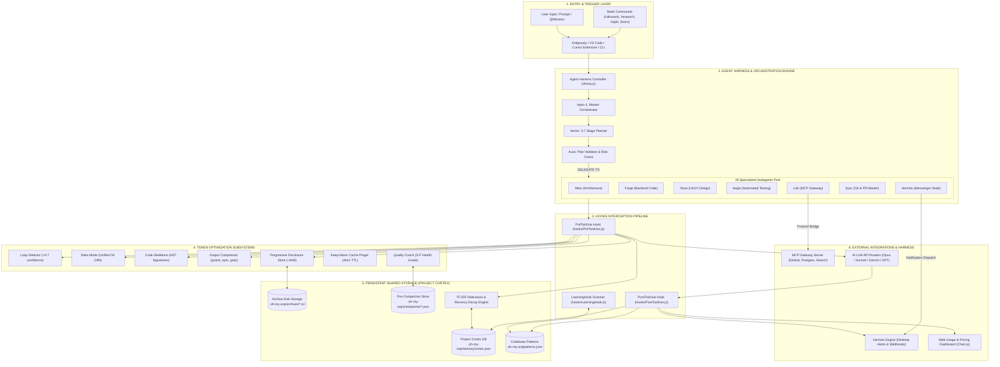
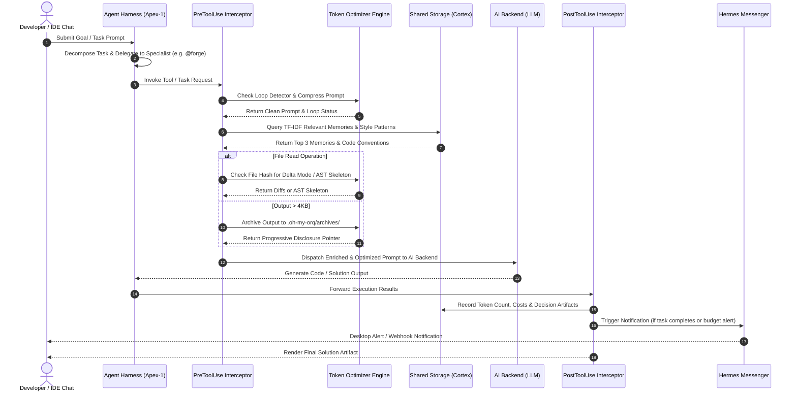

# 📐 oh-my-orq Internal Wireframe & Interaction Architecture

This document provides a detailed technical wireframe and interaction map showing how **Agents**, **Hooks**, **Shared Storage (Cortex)**, **MCP Gateway**, **Token Optimization Engine**, and **Hermes Messaging Harness** interact internally.

---

## 🏛️ 1. Complete Internal Wireframe & Component Map

---

## 🔄 2. Internal Subsystem Interaction Flow

---

## 🛠️ 3. Detailed Component Interaction Specifications

### A. Agent Harness & Delegation Layer (`cli/orq.js` & `skills/`)
- **Agent Coordinator**: Manages active agent instances (`Apex-1`, `Vector`, `Atlas`, `Forge`, `Nova`, `Aegis`, `Link`, `Sync`, `Hermes`, etc.).
- **Delegation Protocol**: When `Apex-1` processes a prompt, it emits `[DELEGATE TO: <agent>]`. The harness intercepts this directive, isolates prompt context for that specialist, and executes the target agent persona.

---

### B. PreToolUse & PostToolUse Hooks Pipeline (`hooks/`)
- **`PreToolUse.js`**:
  1. **Loop Detection**: Calculates MD5 signature hashes of recent tool calls. If identical calls repeat with confidence $> 0.7$, it injects a warning alert to break infinite retry loops.
  2. **Delta Mode**: Compares file SHA-256 hashes against prior reads. Re-reads return unified git diffs instead of full files (saving 85-95% tokens).
  3. **Code Skeletons**: Replaces large first-time or re-read code files with structural AST skeletons (imports, exports, class & method signatures).
  4. **Progressive Disclosure**: Tool outputs $> 4\text{ KB}$ are written to `.oh-my-orq/archives/<id>.txt`. Context receives a 100-token preview + `orq expand <id>` command.
  5. **Cortex Memory Recall**: Executes TF-IDF keyword matching with exponential recency decay ($e^{-\lambda t}$) against `.oh-my-orq/memory/cortex.json`.
  6. **Style Injection**: Fetches codebase conventions (`ES6`/`CommonJS`, `camelCase`/`snake_case`, `async/await`) from `.oh-my-orq/patterns.json`.
- **`PostToolUse.js`**:
  1. Records input/output tokens, cache hits, and estimated cost (USD) into the local SQLite/JSON usage database.
  2. Auto-captures bug fixes and architecture decisions to Cortex memory.
  3. Triggers system desktop alerts and webhooks via **Hermes Messenger**.

---

### C. Shared Storage Architecture (`memory/`)
- **Project Cortex (`cortex.js` & `schema.sql`)**:
  - Main persistent database located at `.oh-my-orq/memory/cortex.json` (SQLite schema ready).
  - Isolates memory per project workspace URI.
  - Stores memories (`type`, `content`, `tags`, `score`, `timestamp`) and usage metrics (`input_tokens`, `output_tokens`, `cost_usd`, `cached_tokens`).
- **Codebase Pattern Store (`learning.js`)**:
  - Scans target project directories and maintains `.oh-my-orq/patterns.json` detailing project-specific coding conventions.

---

### D. Model Context Protocol (MCP Gateway) (`mcp/`)
- **Managed by Agent `link`**:
  - Bridges `oh-my-orq` agents with external tools via standard MCP JSON-RPC protocol.
  - Pre-configured MCP servers in `mcp/mcp_config.json`:
    - **GitHub MCP**: PR creation, code reviews, issue searches.
    - **PostgreSQL MCP**: Live database schema inspection and queries.
    - **Filesystem MCP**: High-speed local filesystem operations.
    - **Web Search MCP**: Real-time documentation retrieval.

---

### E. Hermes Autonomous Messaging Harness (`hermes/`)
- **Managed by Agent `hermes`**:
  - Dispatches desktop system notifications (macOS `osascript`, Linux `notify-send`, Windows).
  - Posts JSON payloads to Slack, Discord, or Microsoft Teams webhooks.
  - Logs notification events in `.oh-my-orq/messages.json`.
